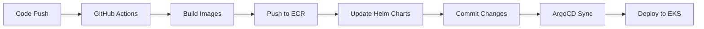

# Retail Store Sample App - GitOps with Amazon EKS Auto Mode
 

 
<div align="center">

[](Stars)


<strong>
<h2>AWS Containers Retail Sample - GitOps Edition</h2>
</strong>

**Modern microservices architecture deployed on AWS EKS using GitOps principles with automated CI/CD pipeline**

</div>

## Table of Contents

<<<<<<< HEAD
- [Overview](#overview)
- [Architecture](#architecture)
- [Prerequisites](#prerequisites)
- [Quick Start](#quick-start)
- [Branch Strategy](#branch-strategy)
- [Getting Started](#getting-started)
- [GitOps Workflow](#gitops-workflow)
- [EKS Auto Mode](#eks-auto-mode)
- [Infrastructure Components](#infrastructure-components)
- [CI/CD Pipeline](#cicd-pipeline)
- [Monitoring and Observability](#monitoring-and-observability)
- [Cleanup](https://github.com/LondheShubham153/retail-store-sample-app/blob/main/README.md#step-12-cleanup)
- [Troubleshooting](#troubleshooting)
=======
- [Quick Start](#-quick-start)
- [️ Architecture](#️-architecture)
- [Prerequisites](#-prerequisites)
- [Installation](#-installation)
- [Deployment](#-deployment)
- [GitOps Workflow](#-gitops-workflow)
- [Monitoring](#-monitoring)
- [Troubleshooting](#-troubleshooting)
- [Cleanup](#-cleanup)
- [Advanced Topics](#-advanced-topics)
>>>>>>> c833a27cd100bbb9de5eb152abd59fb36e1a291c

## Quick Start

<<<<<<< HEAD
The Retail Store Sample App demonstrates a modern microservices architecture deployed on AWS EKS using GitOps principles. The application consists of multiple services that work together to provide a complete retail store experience:

=======
**Deploy the complete retail store application!**
>>>>>>> c833a27cd100bbb9de5eb152abd59fb36e1a291c

- **UI Service**: Java-based frontend
- **Catalog Service**: Go-based product catalog API
- **Cart Service**: Java-based shopping cart API
- **Orders Service**: Java-based order management API
- **Checkout Service**: Node.js-based checkout orchestration API

<<<<<<< HEAD

## Application Architecture

The application has been deliberately over-engineered to generate multiple de-coupled components. These components generally have different infrastructure dependencies, and may support multiple "backends" (example: Carts service supports MongoDB or DynamoDB).


| Component                  | Language | Container Image                                                             | Helm Chart                                                                        | Description                             |
| -------------------------- | -------- | --------------------------------------------------------------------------- | --------------------------------------------------------------------------------- | --------------------------------------- |
| [UI](./src/ui/)            | Java     | [Link](https://gallery.ecr.aws/aws-containers/retail-store-sample-ui)       | [Link](src/ui/chart/values.yaml)    | Store user interface                    |
| [Catalog](./src/catalog/)  | Go       | [Link](https://gallery.ecr.aws/aws-containers/retail-store-sample-catalog)  | [Link](src/catalog/chart/values.yaml)  | Product catalog API                     |
| [Cart](./src/cart/)        | Java     | [Link](https://gallery.ecr.aws/aws-containers/retail-store-sample-cart)     | [Link](src/cart/chart/values.yaml)     | User shopping carts API                 |
| [Orders](./src/orders)     | Java     | [Link](https://gallery.ecr.aws/aws-containers/retail-store-sample-orders)   | [Link](src/orders/chart/values.yaml)   | User orders API                         |
| [Checkout](./src/checkout) | Node     | [Link](https://gallery.ecr.aws/aws-containers/retail-store-sample-checkout) | [Link](src/checkout/chart/values.yaml) | API to orchestrate the checkout process |


## Infrastructure Architecture
=======
---

## Architecture
>>>>>>> c833a27cd100bbb9de5eb152abd59fb36e1a291c

### **Application Architecture**

The retail store consists of 5 microservices working together:

| Service      | Language           | Purpose                | Port |
| ------------ | ------------------ | ---------------------- | ---- |
| **UI**       | Java (Spring Boot) | Web interface          | 8080 |
| **Catalog**  | Go                 | Product catalog API    | 8081 |
| **Cart**     | Java (Spring Boot) | Shopping cart API      | 8082 |
| **Orders**   | Java (Spring Boot) | Order management API   | 8083 |
| **Checkout** | Node.js (NestJS)   | Checkout orchestration | 8084 |


### **Infrastructure Architecture**


**🎯 What you get:**

- **Purpose**: Full production workflow with CI/CD pipeline
- **Images**: Private ECR (auto-updated with commit hashes)
- **Deployment**: Automated via GitHub Actions
- **Updates**: Automatic on code changes
- **Best for**: Production environments, automated workflows, enterprise deployments

### **GitOps Workflow**



---


<<<<<<< HEAD


## Quick Start

**Want to deploy immediately?** Follow these steps for a basic deployment:

1. **Install Prerequisites**: AWS CLI, Terraform, kubectl, Docker, Helm
2. **Configure AWS**: `aws configure` with appropriate credentials
3. **Clone Repository**: `git clone https://github.com/LondheShubham153/retail-store-sample-app.git`
4. **Deploy Infrastructure**: Run Terraform in two phases (see [Getting Started](#getting-started))
5. **Access Application**: Get load balancer URL and browse the retail store

**Need advanced GitOps workflow?** See [BRANCHING_STRATEGY.md](./BRANCHING_STRATEGY.md) for automated CI/CD setup.

## Branch Strategy

This repository uses a **dual-branch approach** for different deployment scenarios:

### 🌐 **Public Application (Main Branch)**
- **Purpose**: Simple deployment with public images
- **Images**: Public ECR (stable versions like v1.2.2)
- **Deployment**: Manual control with umbrella chart
- **Updates**: Manual only
- **Best for**: Demos, learning, quick testing, simple deployments

### 🏭 **Production (GitOps Branch)**
- **Purpose**: Full production workflow with CI/CD pipeline
- **Images**: Private ECR (auto-updated with commit hashes)
- **Deployment**: Automated via GitHub Actions
- **Updates**: Automatic on code changes
- **Best for**: Production environments, automated workflows, enterprise deployments

> **📚 For detailed branching strategy, CI/CD setup, and advanced workflows, see [BRANCHING_STRATEGY.md](./BRANCHING_STRATEGY.md)**
=======
1. **Install Prerequisites**: AWS CLI, Terraform, kubectl, Docker, Helm
2. **Configure AWS**: `aws configure` with appropriate credentials
3. **Clone Repository**: `git clone https://github.com/LondheShubham153/retail-store-sample-app.git`
4. **Deploy Infrastructure**: Run Terraform in two phases (see [Getting Started](#getting-started))
5. **Access Application**: Get load balancer URL and browse the retail store

### **Required Tools**
>>>>>>> c833a27cd100bbb9de5eb152abd59fb36e1a291c

| Tool          | Version | Installation                                                                         |
| ------------- | ------- | ------------------------------------------------------------------------------------ |
| **AWS CLI**   | v2+     | [Install Guide](https://docs.aws.amazon.com/cli/latest/userguide/install-cliv2.html) |
| **Terraform** | 1.0+    | [Install Guide](https://developer.hashicorp.com/terraform/install)                   |
| **kubectl**   | 1.33+   | [Install Guide](https://kubernetes.io/docs/tasks/tools/)                             |
| **Docker**    | 20.0+   | [Install Guide](https://docs.docker.com/get-docker/)                                 |
| **Helm**      | 3.0+    | [Install Guide](https://helm.sh/docs/intro/install/)                                 |
| **Git**       | 2.0+    | [Install Guide](https://git-scm.com/downloads)                                       |

<<<<<<< HEAD
### Prerequisites

1. **Install Prerequisites**: AWS CLI, Terraform, kubectl, Docker, Helm
2. **Configure AWS**: `aws configure` with appropriate credentials
3. **Clone Repository**: `git clone https://github.com/LondheShubham153/retail-store-sample-app.git`
4. **Deploy Infrastructure**: Run Terraform in two phases (see [Getting Started](#getting-started))
5. **Access Application**: Get load balancer URL and browse the retail store

### **Required Tools**

| Tool          | Version | Installation                                                                         |
| ------------- | ------- | ------------------------------------------------------------------------------------ |
| **AWS CLI**   | v2+     | [Install Guide](https://docs.aws.amazon.com/cli/latest/userguide/install-cliv2.html) |
| **Terraform** | 1.0+    | [Install Guide](https://developer.hashicorp.com/terraform/install)                   |
| **kubectl**   | 1.33+   | [Install Guide](https://kubernetes.io/docs/tasks/tools/)                             |
| **Docker**    | 20.0+   | [Install Guide](https://docs.docker.com/get-docker/)                                 |
| **Helm**      | 3.0+    | [Install Guide](https://helm.sh/docs/intro/install/)                                 |
| **Git**       | 2.0+    | [Install Guide](https://git-scm.com/downloads) 

Follow these steps to **install Prerequisites:**


### **Quick Installation Scripts**

<details>
<summary><strong>🔧 One-Click Installation</strong></summary>

```bash
#!/bin/bash
# Install all prerequisites

=======
### **Quick Installation Scripts**

<details>
<summary><strong>🔧 One-Click Installation (Linux/macOS)</strong></summary>

```bash
#!/bin/bash
# Install all prerequisites

>>>>>>> c833a27cd100bbb9de5eb152abd59fb36e1a291c
# AWS CLI
curl "https://awscli.amazonaws.com/awscli-exe-linux-x86_64.zip" -o "awscliv2.zip"
unzip awscliv2.zip
sudo ./aws/install

# Terraform
curl -fsSL https://apt.releases.hashicorp.com/gpg | sudo apt-key add -
sudo apt-add-repository "deb [arch=amd64] https://apt.releases.hashicorp.com $(lsb_release -cs) main"
sudo apt-get update && sudo apt-get install terraform

# kubectl
curl -LO "https://dl.k8s.io/release/v1.33.3/bin/linux/amd64/kubectl"
chmod +x kubectl
sudo mv kubectl /usr/local/bin/

# Docker
curl -fsSL https://get.docker.com -o get-docker.sh
sudo sh get-docker.sh

# Helm
curl https://raw.githubusercontent.com/helm/helm/main/scripts/get-helm-3 | bash

# Verify installations
aws --version
terraform --version
kubectl version --client
docker --version
helm version
```

</details>

<<<<<<< HEAD

## Follow these steps to deploy the application:

### Step 1. Configure AWS with **`Root User`** Credentials:

  Ensure your AWS CLI is configured with the **Root user credentials:**

```sh
aws configure
```

### Step 2. Clone the Repository:

```sh
git clone https://github.com/LondheShubham153/retail-store-sample-app.git
```

> [!IMPORTANT]
> ### Step 3: Choose Your Deployment Strategy
>
> **For Public Application (Main Branch):**
> - Uses stable public ECR images (v1.2.2)
> - Manual deployment control
> - No GitHub Actions required
> - Skip to Step 4 - infrastructure is ready
>
> **For Production (GitOps Branch):**
> - Uses private ECR with automated CI/CD
> - Requires GitHub Actions setup
> - See [BRANCHING_STRATEGY.md](./BRANCHING_STRATEGY.md) for complete setup
=======
### **AWS Account Requirements**

- **AWS Account** with appropriate permissions

---

## 🔧 Installation

### **Step 1: Clone Repository**

```bash
git clone https://github.com/LondheShubham153/retail-store-sample-app.git
cd retail-store-sample-app
git checkout gitops
```

### **Step 2: Configure AWS**
>>>>>>> c833a27cd100bbb9de5eb152abd59fb36e1a291c

```bash
# Configure AWS CLI
aws configure

# Verify configuration
aws sts get-caller-identity
aws eks list-clusters --region us-west-2
```

<<<<<<< HEAD
=======
### **Step 3: Setup GitHub Secrets (Required for GitOps)**

Go to your GitHub repository → **Settings** → **Secrets and variables** → **Actions**

Add these secrets:

| Secret Name             | Description    | Example        |
| ----------------------- | -------------- | -------------- |
| `AWS_ACCESS_KEY_ID`     | AWS Access Key | `AKIA...`      |
| `AWS_SECRET_ACCESS_KEY` | AWS Secret Key | `wJalrXUt...`  |
| `AWS_REGION`            | AWS Region     | `us-west-2`    |
| `AWS_ACCOUNT_ID`        | AWS Account ID | `123456789012` |

---

## Deployment

### **Phase 1: Infrastructure Deployment**

```bash
cd terraform/
```

>>>>>>> c833a27cd100bbb9de5eb152abd59fb36e1a291c
```sh
# Initialize Terraform
terraform init
<<<<<<< HEAD
terraform apply --auto-approve
=======
>>>>>>> c833a27cd100bbb9de5eb152abd59fb36e1a291c
```


<<<<<<< HEAD
This creates the core infrastructure, including:
- VPC with public and private subnets
- Amazon EKS cluster with Auto Mode enabled
- Security groups and IAM roles

And deploys:
- ArgoCD for Setup GitOps
- NGINX Ingress Controller
- Cert Manager for SSL certificates


### Step 5: Update kubeconfig to Access the Amazon EKS Cluster:
```
aws eks update-kubeconfig --name retail-store --region <region>
```

> Application is live with Public image:

- Get your ingress EXTERNAL-IP and paste it in the browser to access retail-store application.
    ```sh
    kubectl get svc -n ingress-nginx
    ```

> [!NOTE]
> Let's move forward with GitOps principle utilising Amazon private registry to create private registry and store images.

### Step 6: GitHub Actions (Production Branch Only)

> **Note**: This step is only required if you're using the **Production branch** for automated deployments. Skip this step if using the **Public Application branch** for simple deployment.

For GitHub Actions, first configure secrets so the pipelines can be automatically triggered:

**Create an IAM User, policies, and generate credentials**

**Go to your GitHub repo → Settings → Secrets and variables → Actions → New repository secret.**


| Secret Name           | Value                              |
|-----------------------|------------------------------------|
| `AWS_ACCESS_KEY_ID`   | `Your AWS Access Key ID`           |
| `AWS_SECRET_ACCESS_KEY` | `Your AWS Secret Access Key`     |
| `AWS_REGION`          | `region-name`                       |
| `AWS_ACCOUNT_ID`        | `your-account-id` |


> [!IMPORTANT]
> Once the entire cluster is created, any changes pushed to the repository will automatically trigger GitHub Actions.

GitHub Actions will automatically build and push the updated Docker images to Amazon ECR.


### Verify Deployment

Check if the nodes are running:

```bash
kubectl get nodes
```

### Step 7: Access the Application:

The application is exposed through the NGINX Ingress Controller. Get the load balancer URL:
=======
```sh
# Deploy EKS cluster and VPC
terraform apply -target=module.retail_app_eks -target=module.vpc --auto-approve
```

**⏱️ Expected time: 15-20 minutes**

This creates:

- ✅ VPC with public/private subnets
- ✅ EKS cluster with Auto Mode
- ✅ Security groups and IAM roles

### **Phase 2: Configure kubectl**

```bash
# Get cluster name (with random suffix)
terraform output cluster_name

# Update kubeconfig
aws eks update-kubeconfig --region us-west-2 --name $(terraform output -raw cluster_name)

# Verify connection
kubectl get nodes
```

### **Phase 3: Deploy Applications**
>>>>>>> c833a27cd100bbb9de5eb152abd59fb36e1a291c

```bash
# Deploy ArgoCD and add-ons
terraform apply --auto-approve
```

**⏱️ Expected time: 05-10 minutes**

This deploys:

- ✅ ArgoCD for GitOps
- ✅ NGINX Ingress Controller
- ✅ Cert Manager for SSL
- ✅ ArgoCD applications

### **Phase 4: Access Application**

```bash
# Get load balancer URL
kubectl get svc -n ingress-nginx
```

**🌐 Open the URL in your browser to access the retail store!**


<<<<<<< HEAD
### Step 8: Argo CD Automated Deployment:
=======
---
>>>>>>> c833a27cd100bbb9de5eb152abd59fb36e1a291c

## GitOps Workflow

### **How It Works**

1. **Code Push** → Changes to `src/` directory
2. **GitHub Actions** → Detects changed services
3. **Build & Push** → Creates Docker images in ECR
4. **Update Charts** → Modifies Helm chart values
5. **ArgoCD Sync** → Automatically deploys to EKS

<<<<<<< HEAD
### Step 9: Port-forward to Argo CD UI and login:

**Get ArgoCD admin password**
```
kubectl -n argocd get secret argocd-initial-admin-secret -o jsonpath='{.data.password}' | base64 -d
```

**Port-forward to Argo CD UI**
```
kubectl port-forward svc/argocd-server -n argocd 8080:443 &
```

Open your browser and navigate to:
https://localhost:8080

Username: admin 

Password: <output of previous command>

### Step 10: Access ArgoCD UI

Once ArgoCD is deployed, you can access the web interface:


The ArgoCD UI provides:
- **Application Status**: Real-time sync status of all services
- **Resource View**: Detailed view of Kubernetes resources
- **Sync Operations**: Manual sync and rollback capabilities
- **Health Monitoring**: Application and resource health status

### Step 11: Monitor Application Deployment
=======


### **Making Changes**
>>>>>>> c833a27cd100bbb9de5eb152abd59fb36e1a291c

```bash
# 1. Make changes to any service
vim src/ui/src/main/resources/templates/fragments/bare.html

# 2. Commit and push
git add .
git commit -m "Add new feature to UI"
git push origin gitops

# 3. Monitor deployment
# - Check GitHub Actions: https://github.com/LondheShubham153/actions
# - Check ArgoCD UI: https://localhost:9090
```

The workflow automatically detects which services changed:

### **Component Details**

| Component                   | Language | Container Image                                                             | Helm Chart                              | Description                             |
| --------------------------- | -------- | --------------------------------------------------------------------------- | --------------------------------------- | --------------------------------------- |
| [UI](./src/ui/)             | Java     | [ Link](https://gallery.ecr.aws/aws-containers/retail-store-sample-ui)      | [ Chart](src/ui/chart/values.yaml)      | Store user interface                    |
| [Catalog](./src/catalog/)   | Go       | [ Link](https://gallery.ecr.aws/aws-containers/retail-store-sample-catalog) | [ Chart](src/catalog/chart/values.yaml) | Product catalog API                     |
| [Cart](./src/cart/)         | Java     | [Link](https://gallery.ecr.aws/aws-containers/retail-store-sample-cart)     | [Chart](src/cart/chart/values.yaml)      | User shopping carts API                 |
| [Orders](./src/orders/)     | Java     | [Link](https://gallery.ecr.aws/aws-containers/retail-store-sample-orders)   | [Chart](src/orders/chart/values.yaml)    | User orders API                         |
| [Checkout](./src/checkout/) | Node.js  | [Link](https://gallery.ecr.aws/aws-containers/retail-store-sample-checkout) | [Chart](src/checkout/chart/values.yaml)  | API to orchestrate the checkout process |

---

## Monitoring

### **ArgoCD Dashboard**

```bash
# Get ArgoCD admin password
kubectl -n argocd get secret argocd-initial-admin-secret -o jsonpath='{.data.password}' | base64 -d

# Port-forward to ArgoCD UI
kubectl port-forward svc/argocd-server -n argocd 9090:443 &

# Access: https://localhost:9090
# Username: admin
# Password: (from above command)
```


### **Application Status**

```bash
# Check all applications
kubectl get applications -n argocd

# Check application health
kubectl describe application retail-store-ui -n argocd

# Check pods
kubectl get pods -n retail-store

# Check services
kubectl get svc -n retail-store

# Check ingress
kubectl get ingress -n retail-store
```

<<<<<<< HEAD
### Step 12: Cleanup
To delete all resources created by Terraform:
=======
## 🔧 Troubleshooting

### **Useful Commands**

```bash
# Get cluster info
kubectl cluster-info

# Check nodes
kubectl get nodes

# Check all namespaces
kubectl get pods -A

# Check logs
kubectl logs -n retail-store deployment/ui

# Check events
kubectl get events -n retail-store
```

---

### **Debug Commands**

```bash
# Check all resources
kubectl get all -A

# Check events across all namespaces
kubectl get events --sort-by='.lastTimestamp'

# Check ArgoCD logs
kubectl logs -n argocd deployment/argocd-server
kubectl logs -n argocd deployment/argocd-application-controller

# Check ingress controller logs
kubectl logs -n ingress-nginx deployment/ingress-nginx-controller

# Check application logs
kubectl logs -n retail-store deployment/ui
kubectl logs -n retail-store deployment/catalog
>>>>>>> c833a27cd100bbb9de5eb152abd59fb36e1a291c
```

---

## Advanced Topics

### **Customization**

<details>
<summary><strong>🔧 Enable Monitoring</strong></summary>

```bash
# Edit terraform/addons.tf
enable_kube_prometheus_stack = true

# Apply changes
terraform apply --auto-approve

# Access Grafana
kubectl port-forward svc/kube-prometheus-stack-grafana -n monitoring 3000:80
```

</details>

---

## Cleanup

### **Destroy Infrastructure**

```bash
cd terraform/

# Option 1: Destroy everything at once
terraform destroy --auto-approve

# Option 2: Destroy in phases (recommended)
terraform destroy -target=module.eks_addons --auto-approve
terraform destroy -target=module.retail_app_eks --auto-approve
terraform destroy --auto-approve
```


<<<<<<< HEAD
> [!NOTE]
> ECR Repositories you need to Delete it from AWS Console Manually.
=======
### **Clean Up ECR Repositories**
>>>>>>> c833a27cd100bbb9de5eb152abd59fb36e1a291c

```bash
# Delete ECR repositories (manual step)
aws ecr delete-repository --repository-name retail-store-ui --force
aws ecr delete-repository --repository-name retail-store-catalog --force
aws ecr delete-repository --repository-name retail-store-cart --force
aws ecr delete-repository --repository-name retail-store-checkout --force
aws ecr delete-repository --repository-name retail-store-orders --force
```

### **Remove GitHub Secrets**

1. Go to GitHub repository → **Settings** → **Secrets and variables** → **Actions**
2. Delete all AWS-related secrets

---

## 🤝 Contributing

1. Fork the repository
2. Create a feature branch (`git checkout -b feature/amazing-feature`)
3. Commit your changes (`git commit -m 'Add amazing feature'`)
4. Push to the branch (`git push origin feature/amazing-feature`)
5. Open a Pull Request

---

## Troubleshooting

### Common Issues

#### **Image Pull Errors**
```
Error: Failed to pull image "123456789012.dkr.ecr.us-west-2.amazonaws.com/retail-store-ui:abc1234"
```
**Solutions**:
1. Ensure you're using the correct branch for your deployment strategy
2. For Production branch: Check GitHub Actions completed successfully
3. For Public Application branch: Verify you're using public ECR images
4. Check AWS credentials and ECR permissions

#### **GitHub Actions Not Triggering**
**Solutions**:
1. Ensure changes are in `src/` directory
2. Verify you're on the `production` branch (gitops)
3. Check GitHub Actions is enabled in repository settings
4. Review [BRANCHING_STRATEGY.md](./BRANCHING_STRATEGY.md) for detailed setup

### Getting Help

- **Basic deployment issues**: Check this README
- **Advanced GitOps issues**: See [BRANCHING_STRATEGY.md](./BRANCHING_STRATEGY.md)
- **Infrastructure issues**: Review Terraform logs
- **Application issues**: Check ArgoCD UI and kubectl logs

## License

This project is licensed under the Apache License 2.0 - see the [LICENSE](./LICENSE) file for details.

<<<<<<< HEAD
=======
---

## 🙏 Acknowledgments

- **AWS Containers Team** for the original sample application
- **ArgoCD Community** for the excellent GitOps tooling
- **Terraform Community** for the AWS modules
- **GitHub Actions** for the CI/CD platform

---

>>>>>>> c833a27cd100bbb9de5eb152abd59fb36e1a291c
## Support

- **Issues**: [GitHub Issues](https://github.com/LondheShubham153/retail-store-sample-app/issues)
- **Discord**: [TrainWithShubhamCommunity](https://discord.gg/kGEr9mR5gT)

---

<div align="center">

**⭐ Star this repository if you found it helpful!**

**🔄 For advanced GitOps workflows, see [BRANCHING_STRATEGY.md](./BRANCHING_STRATEGY.md)**

</div>
<<<<<<< HEAD

=======
>>>>>>> c833a27cd100bbb9de5eb152abd59fb36e1a291c
